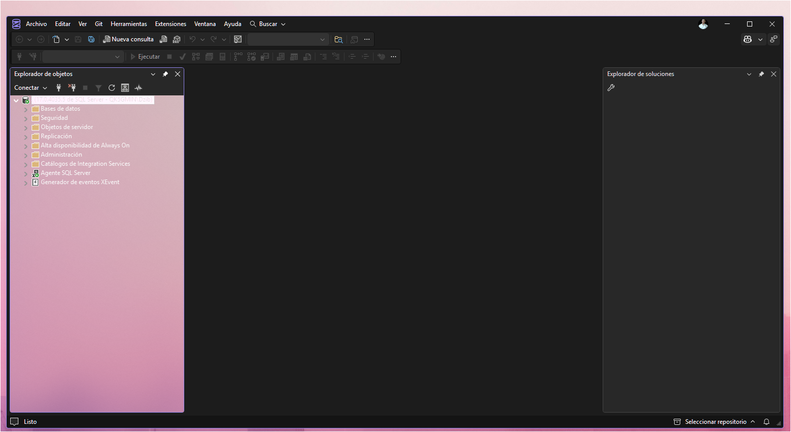

   

# My Windows Development Environment 🚀

---

Arquitectura de desarrollo estandarizada para **Data Engineering** y **Analytics**. Este repositorio contiene la configuración ("dotfiles") para mantener un entorno de trabajo portable, eficiente y libre de conflictos en Windows 11.

## 🏗️ Estructura del Laboratorio

---

```text
 ├── .vscode/                                   # Configuración de VS Code
 │ └── settings.json                            # Ajustes de terminal, fuentes, formato.
 ├── powershell/scripts/                        # Scripts PowerShell (.ps1) | Configuración de PowerShell.
 │    ├──Microsoft.PowerShell_profile.ps1       # Perfil personalizado (alias, funciones).
 │    ├── setup_env.ps1                         # Script de instalación automática.
 │    ├── SQLServiceMenu_v1.ps1                 # Menú interactivo (v1).
 │    └── SQLServiceMenu_v2.ps1                 # Menú interactivo ([v1.1] - mejorado).
 ├── config/                                    # Configuración adicional
 ├── docs/                                      # Documentación y guías.
 ├── IMG/                                       # Capturas y imágenes.
 └── README.md
```

### 🚀 Instalación rápida

### Requisitos previos

- Windows 11
- PowerShell 7+
- VS Code
- Git

### Pasos de instalación

1. **Clonar el repositorio:**
   ```bash
   git clone https://github.com/dzib/My-Dev-Environment.git
   cd My-Dev-Environment
   ```
2. Abrir PowerShell como administrador, ejecutar el script:
   ```powershell
   .\powershell\scripts\setup_env.ps1
   ```
3. Reiniciar PowerShell para aplicar cambios.

## 🛠 Herramientas del Entorno

---

### Sistema & Personalización

- **Windhawk** - Personalización de interfaz (Efecto Mica/Acrylic).
- **PowerToys** - Utilidades de productividad (FancyZones, Renombramiento Rápido, etc.).
- **TranslucentTB** - Barra de tareas minimalista.
- **PC Manager**

### Desarrollo & Bases de Datos

- **SQL Server 2022** - Motor de base de datos.
- **SQL Server Management Studio (SSMS) 22** - Gestión de BD con tema oscuro personalizado.
- **VS Code** - Editor de código con extensión PowerShell.
- **PowerShell 7** - Shell moderno para Windows.

### Productividad

- **7-Zip** - Compresión de archivos.
- **Notion** - Notas y documentación.
- **Chrome/Edge** - Navegadores con efectos Mica inyectados.
- **Terminal Windows** - Terminal integrada.

## ⚡ Scripts de Utilidad

---

### Gestión de SQL Server

Los scripts en automatizan la gestión del servicio SQL Server para optimizar recursos: `/scripts`

### Batch (.bat)

- `OFF_SQL.bat` - Inicia el servicio `MSSQLSERVER`.
- `ON_SQL.bat` - Detiene el servicio (reduce CPU y ruido ventilador).

### PowerShell (.ps1)

- `SQLServiceMenu_v1.ps1` → Versión inicial del menú interactivo para controlar SQL Server.
- `SQLServiceMenu_v2.ps1` → Versión mejorada con resumen automático y opción rápida.
- `setup_env.ps1` → Instalador automático del entorno.

### Cómo usar los scripts

Desde PowerShell:

```powershell
# Ejecutar menú SQL Server v2 (recomendado)
.\powershell\scripts\SQLServiceMenu_v2.ps1

# Ejecutar instalador
.\powershell\scripts\setup_env.ps1
```

Desde CMD/Batch:

```bash
# Iniciar SQL Server
.\batch\scripts\OFF_SQL.bat

# Detener SQL Server
.\batch\scripts\ON_SQL.bat
```

## 🎨 Personalizaciones Aplicadas

---

### Efectos Mica en Aplicaciones Chromium

Inyectado mediante Windhawk con flag:

```Código
--disable-features=RendererCodeIntegrity
```

### Aplicado en:

- Google Chrome
- Microsoft Edge
- Aplicaciones Electron

### SSMS 22 Personalizado

- Tema oscuro nativo activado.
- Efecto Mica Alt forzado mediante inyección.
- Configuración en Registro de Windows para persistencia. - (Prueba de concepto)
  Captura: 
  - -- SSMS 22 con efecto Mica Alt (Forzado mediante inyección de Windhawk) --
    \*Nota: Mantego la configuración manual del registro para preservar el Dark Mode nativo de SSMS 22, garantizando un entorno de trabajo con menor fatiga visual sin depender de software de terceros.

## 📝 Perfil de PowerShell

---

El archivo incluye: `Microsoft.PowerShell_profile.ps1`

- Alias personalizados forzado (para R, etc.). `R`
- Configuración de lectura de línea (modo de edición de Windows).
- Mensaje de bienvenida personalizado.
- Variables de entorno automáticas.

Edítalo según tus necesidades:

```PowerShell
# Abre tu perfil
code $PROFILE

# Recarga los cambios
. $PROFILE
```

## 🔄 Historial de Versiones

---

### v1.1.1 (2026-15-07) - Lanzamiento inicial

- ✅ Estructura base del repositorio.
- ✅ Scripts SQL Server (v1 y v2).
- ✅ Configuración VS Code (.vscode/settings.json).
- ✅ Perfil PowerShell personalizado.
- ✅ Script de instalación automática.
- ✅ Documentación completa.

  **v1.0.0 (2026-05-01):** Menú básico con pausa manual.
  **v1.1.0 (2026-05-02):** Menú mejorado con resumen automático y opción rápida.

## 📚 Documentación Adicional

---

Para guías detalladas, consulta la carpeta: `/docs`

- Montaje inicial.
- Resolución de problemas.
- Personalización avanzada.

## 🤝 Contribuciones

---

Este es un repositorio personal, pero las mejoras son bienvenidas. Si tienes sugerencias:

1. Crea una rama `feature/nombre-mejora`
2. Haz commit con descripción clara.
3. Abre un Pull Request.

## 📄 Licencia

---

**Autor:** **Jesús Alberto Dzib Ku**
Este proyecto es de uso personal. Siéntete libre de adaptarlo a tu entorno.
⚖️ **Licencia MIT** © 2026

_"Construyendo sistemas que no solo procesan datos, sino que cuentan historias."_

### 📝 Conclusión y Aprendizajes Técnicos

Retos de Inyección: El caso de SSMS 22

- En este proyecto de personalización no solo aplique una transformación a la estética de mi entorno de trabajo, sino que sirvió como un ejercicio profundo de ingeniería inversa y depuración de sistema.

A través de la implementación de Windhawk, logré inyectar con éxito efectos de transparencia (Mica/Acrylic) en aplicaciones complejas como Chrome, Edge y Notion. El reto más significativo fue SSMS 22, donde exploré la modificación directa de código fuente en C++ y la manipulación del Registro de Windows para habilitar temas ocultos. Aunque SSMS presenta restricciones de renderizado por su arquitectura de subprocesos (DevHub.exe), el proceso documentado aquí demuestra la viabilidad de la inyección forzada y el manejo de prioridades en el Desktop Window Manager (DWM)

🚧 En constante evolución.
